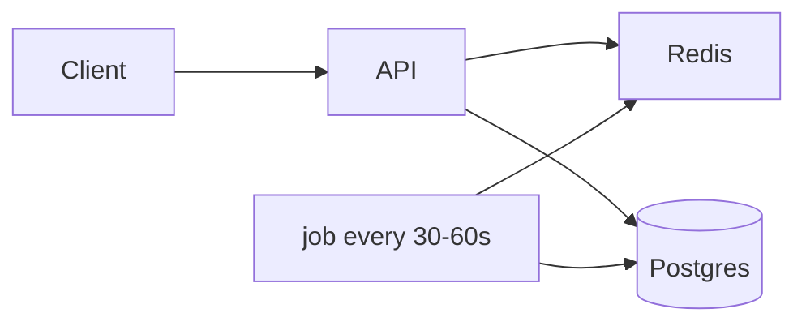
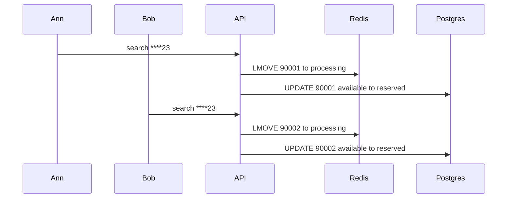

# Lottery search

Design only — no code. Thai version: [`lottery-search.th.md`](./lottery-search.th.md)

## The brief

Ten million tickets, each a 6-digit number (`000000`–`999999`). Search is a 6-character pattern of digits and `*`.

| Pattern | Meaning |
|---|---|
| `****23` | ends with 23 |
| `1****5` | starts with 1, ends with 5 |
| `123***` | starts with 123 |

The same ticket must not go to two people at the same time. Search has to stay usable at 10M rows.

The brief does not define the API, how many tickets come back, or whether a search is a sale. I had to lock those down before the rest of the design makes sense.

## Assumptions

I would return a page of **20** tickets (`limit` 1–50), not the full match set. `****23` can hit on the order of 100k numbers. Returning all of them in one response makes the API unusable, and you cannot keep tickets exclusive.

A search **holds** tickets for 45 seconds (`reserved`). Other searches skip those rows. Confirm turns them `sold`; timeout or release puts them back `available`. That matches “at the same time” better than writing `sold` on every search.

A hold counts only after Postgres writes it. Redis just speeds up busy patterns. If Redis is down, the API still holds tickets in Postgres.

One table row is one ticket (`id`). `number` is what is printed. Ten million rows is more than one million unique 6-digit strings, so the same number can exist on more than one row. Exclusive holds are always by `id`.

Figures below are estimates, not load-test results.

Pattern must be length 6, each character `0-9` or `*`. Anything else returns 400.

## Overview

```
client → API → Redis (queue / processing)
             → PostgreSQL (tickets, allocations)

background job every 30–60s (single instance)
  expire holds, reclaim stuck processing ids, refill short queues
```

Searching 10M rows where digit 5 is 2 and digit 6 is 3 is fine in Postgres if I return 20 rows and the index is right. The hard part is a lot of people hitting the same popular pattern at once.

So Redis `LMOVE` hands out distinct ids in memory, then Postgres records the hold. Redis alone would make it harder to see who owns a ticket and to keep a history.

I would not pre-build a queue for every 6-character mask. Too many combinations. Queues only for prefix/suffix (the examples in the brief) and whatever else actually gets traffic.

| Path | When | Redis | Postgres |
|---|---|---|---|
| queue | prefix / suffix / both | move id to processing | update by `id` |
| SQL | `*2*4*5`, no queue yet, Redis down | optional short lock | `FOR UPDATE SKIP LOCKED` |



## Why Postgres + Redis

Reserve the ticket and insert `allocations` in the same transaction. If the process crashes mid-way, roll back.

`SELECT … FOR UPDATE SKIP LOCKED` lets several workers take **different** rows without waiting on a row someone else already locked ([docs](https://www.postgresql.org/docs/current/sql-select.html)).

Redis `LMOVE` / `BLMOVE` moves work from the queue onto a processing list. If the worker dies, the id is still there to reclaim ([LMOVE](https://redis.io/docs/latest/commands/lmove/), [job queue](https://redis.io/docs/latest/develop/use-cases/job-queue/go/)). Optional lock: `SET … NX EX`. A Lua script deletes the key only if the value is still ours ([distributed locks](https://redis.io/docs/latest/develop/clients/patterns/distributed-locks/)).

What I would skip:

- Regex on a 6-char string — `*` turns into a scan, and concurrent holds are messier than `SKIP LOCKED`
- Elasticsearch — strong at search, but it cannot hold a ticket for someone. You still need a database, plus sync.
- Redis only — fast, but it is hard to see what a ticket is right now, and long history is awkward
- `LIKE` only — suffixes and holes in the middle do not use a normal B-tree well
- `LPOP` and drop — if the process dies after the pop, before SQL, the id is gone from Redis while the row is still free

## Tables

I split digits into `d1`–`d6` so a known position can be filtered with equality, for example `d5 = 2`, which B-trees handle well.

```sql
CREATE TABLE tickets (
    id           BIGSERIAL PRIMARY KEY,
    number       CHAR(6) NOT NULL CHECK (number ~ '^[0-9]{6}$'),
    d1           SMALLINT NOT NULL CHECK (d1 BETWEEN 0 AND 9),
    d2           SMALLINT NOT NULL CHECK (d2 BETWEEN 0 AND 9),
    d3           SMALLINT NOT NULL CHECK (d3 BETWEEN 0 AND 9),
    d4           SMALLINT NOT NULL CHECK (d4 BETWEEN 0 AND 9),
    d5           SMALLINT NOT NULL CHECK (d5 BETWEEN 0 AND 9),
    d6           SMALLINT NOT NULL CHECK (d6 BETWEEN 0 AND 9),
    status       TEXT NOT NULL DEFAULT 'available'
                 CHECK (status IN ('available', 'reserved', 'sold')),
    reserved_by  TEXT,
    reserved_at  TIMESTAMPTZ,
    lease_until  TIMESTAMPTZ,
    sold_to      TEXT,
    sold_at      TIMESTAMPTZ,
    version      INT NOT NULL DEFAULT 0,
    CONSTRAINT tickets_digits_match_number CHECK (
        number = d1::text || d2::text || d3::text || d4::text || d5::text || d6::text
    )
);

CREATE TABLE allocations (
    id           BIGSERIAL PRIMARY KEY,
    ticket_id    BIGINT NOT NULL REFERENCES tickets (id),
    user_id      TEXT NOT NULL,
    request_id   TEXT NOT NULL,
    path         TEXT NOT NULL CHECK (path IN ('queue', 'sql', 'sql_fallback')),
    pattern      CHAR(6) NOT NULL,
    state        TEXT NOT NULL CHECK (state IN ('leased', 'confirmed', 'expired', 'released')),
    leased_at    TIMESTAMPTZ NOT NULL DEFAULT NOW(),
    expires_at   TIMESTAMPTZ NOT NULL,
    UNIQUE (request_id, ticket_id)
);

CREATE INDEX allocations_ticket_leased
    ON allocations (ticket_id)
    WHERE state = 'leased';
```

```
available → reserved → sold
                ↓
           available   (hold expired or released)
```

`version` increments on a successful status change so a delayed writer cannot overwrite a newer state.

## Indexes

A composite B-tree is used from the left. `(d1,…,d6)` will not help `d2, d4, d6` when `d1` is `*`. I would only add indexes for patterns people actually search.

```sql
CREATE INDEX idx_t_suffix_2
    ON tickets (d5, d6, id)
    WHERE status = 'available';

CREATE INDEX idx_t_prefix_3
    ON tickets (d1, d2, d3, id)
    WHERE status = 'available';

CREATE INDEX idx_t_prefix_suffix
    ON tickets (d1, d6, id)
    WHERE status = 'available';

CREATE INDEX idx_t_prefix_1
    ON tickets (d1, id)
    WHERE status = 'available';
```

Partial on `available` so the index shrinks as tickets sell.

For `*2*4*5`, use whatever index can start from a known digit; otherwise filter with `LIMIT` and `SKIP LOCKED`. Return at most 50 rows to the API, not a million-row scan.

Extra indexes slow writes a bit. At 10M rows that is acceptable. I would not add an index per wildcard shape.

## Pattern groups

A bad pattern returns 400.

| Example | Group | SQL | Redis |
|---|---|---|---|
| `****23` | last 2 | `d5=2 AND d6=3` | `queue:suffix:23` |
| `123***` | first 3 | `d1=1 AND d2=2 AND d3=3` | `queue:prefix:123` |
| `1****5` | first and last | `d1=1 AND d6=5` | `queue:px:1_5` |
| `*2*4*5` | holes in the middle | `d2=2 AND d4=4 AND d6=5` | none |
| `******` | all wildcard | `status='available'` | none, SQL + `LIMIT` |

Same printed number can sit on more than one row. Exclusive hold is always `id`.

```
id 90001  number 482123
          d1 d2 d3 d4 d5 d6
          4  8  2  1  2  3

****23  → match (last two are 2, 3)
123***  → no
1****5  → no
*2*4*5  → no
```

## Holding tickets without races

A hold is real only after Postgres saves `reserved` or `sold`. Redis just helps pick ids faster.

Do not `LPOP`. If the API dies before the update, the id is gone from Redis and the row is still free. Move it to processing instead:

```
LMOVE queue:suffix:23  processing:suffix:23  LEFT  LEFT
```

After Postgres succeeds, remove it from processing and `SREM` the set. If the process dies, the job finds processing entries older than ~60s: still `available` → `RPUSH` back on the list; already reserved/sold → drop from processing and the set.

The queue is a list so `LMOVE` works. A separate set (`set:suffix:23`) remembers ids already on the queue or in processing. On refill, `SADD` first; `RPUSH` only if the id was new. Do not `LMOVE` a set. If you `RPUSH` straight from a SQL snapshot, the same id can land on the list twice; the update still rejects doubles, but you waste retries.

SQL path:

```sql
WITH picked AS (
    SELECT id
    FROM tickets
    WHERE d2 = 2 AND d4 = 4 AND d6 = 5
      AND status = 'available'
    ORDER BY id
    LIMIT 20
    FOR UPDATE SKIP LOCKED
)
UPDATE tickets t
SET status = 'reserved',
    reserved_by = :request_id,
    reserved_at = NOW(),
    lease_until = NOW() + INTERVAL '45 seconds',
    version = t.version + 1
FROM picked
WHERE t.id = picked.id
  AND t.status = 'available'
RETURNING t.id, t.number;
```

The second worker skips locked rows and takes the next free ones.

Optional Redis `SET lock:ticket:<id> <request_id> NX EX 30`. Unlock with Lua that deletes only if the value is still ours. Do not `DEL` the key outright.

Every path, including the queue, must update only if the row is still free:

```sql
UPDATE tickets
SET status = 'reserved',
    reserved_by = :request_id,
    reserved_at = NOW(),
    lease_until = NOW() + INTERVAL '45 seconds',
    version = version + 1
WHERE id = :id
  AND status = 'available';
```

If no ticket was updated, someone else already took it. Try the next id. Insert `allocations` in the same transaction.

A valid pattern with no tickets left is 200 and an empty list, not 404.

Confirm succeeds only while the tickets are still `reserved` by this request and the lease has not expired; then they become `sold`. Release or timeout puts them back `available`.

## Redis keys

| Key | Role |
|---|---|
| `queue:suffix:23` | waiting ids (list) |
| `processing:suffix:23` | picked, hold not written in Postgres (list) |
| `set:suffix:23` | ids already on the queue or in processing |
| `lock:ticket:<id>` | short lock |
| `meta:reconcile:last_run` | last job run |

Only build what we need: 100 suffix-2 queues (`00`–`99`). Prefix-3 on first use, not 1000 keys at boot. Prefix+suffix only for patterns we actually see.

Do not put the same ticket on every overlapping queue — RAM usage grows too fast. Start with suffix-2. Patterns with holes in the middle stay SQL-only.

## Background job (every 30–60s)

One instance (Postgres advisory lock or Redis `SET NX`).

1. `reserved` past `lease_until` → `available`
2. processing older than ~60s: free → `RPUSH` back to the list; reserved/sold → delete from processing and the set
3. if the queue list is shorter than a threshold (say 500) → free ids from Postgres: `SADD`, then `RPUSH` if new
4. write last-run time; if it goes stale, the API can stay on SQL only

## Logging

Every request has a `request_id`. JSON logs include path, pattern, ids, and latency.

Watch queue length, stuck processing, holds past `lease_until`, when the job last ran, and queue vs SQL mix.

A search for `request_id` should show the whole request.

## Performance estimates

Queue path takes a few ms. SQL path maybe 5–20 ms at `LIMIT 20`.

Last two digits before the limit: ~1% of the table (~100k rows), but `LIMIT 20` stops early. First three digits: ~0.1%.

If Redis is down, every request goes to Postgres. Holds stay correct, throughput drops with the database. Postgres is the bottleneck — a few thousand holds/s on a modest box, not hundreds of thousands.

Redis makes the busy patterns fast so Postgres is not doing the search. Whether the hold sticks depends on `UPDATE … WHERE status = 'available'`, not Redis.

Digit columns and extra indexes cost disk and slower writes. Worth it so the patterns in the brief hit the indexes we added.

## Failure cases

| Case | Outcome |
|---|---|
| Two people, same pattern | different `id`s from the queue and/or `SKIP LOCKED` |
| Process dies after `LMOVE`, before SQL | remains in processing; the job puts it back if still free |
| Process dies after SQL, before removing processing | the job deletes it from processing because the ticket is already reserved or sold |
| Redis down | search and hold in Postgres only |
| Redis lock expires mid-request | only our Redis lock is deleted; Postgres will not hold the same ticket twice |
| Duplicate id in a queue | no ticket was updated; try the next id |
| Hold expired, user still has the JSON | confirm fails; search again |

See [Examples](#examples).

## Examples

Each subsection matches a row in Failure cases. The three tickets below are used throughout.

| id | number | status at start |
|---|---|---|
| 90001 | 482123 | available |
| 90002 | 000023 | available |
| 90003 | 999923 | available |

### Two people, same pattern

Ann and Bob send `POST /lottery/search` with `****23` and `limit` 1 at the same time.

```
queue:suffix:23  [90001, 90002, 90003]
```



Ann gets `90001` (`482123`). Bob gets `90002` (`000023`). Neither can get `90001` twice because `LMOVE` already took that id off the list, and Postgres only updates while `status = 'available'`.

### Process dies after LMOVE, before SQL

Ann's API `LMOVE`s `90001` onto processing, then the process dies before Postgres runs.

```
queue:suffix:23       [90002, 90003]
processing:suffix:23  [90001]
tickets 90001         still available
```

The job sees `90001` in processing older than ~60s, row still `available`, so it `RPUSH`es `90001` back onto the list. Bob can search and get it. If we had used `LPOP`, `90001` would be gone from Redis forever while the row stayed free.

### Process dies after SQL, before removing processing

Postgres already wrote `90001` as `reserved` for Ann. Then the process dies. `90001` is still on the processing list.

The job sees reserved/sold and drops it from processing and the set. The ticket stays with Ann until confirm or the 45s lease.

### Redis down

Ann searches `****23`. There is no queue. The API uses `FOR UPDATE SKIP LOCKED` on `d5 = 2 AND d6 = 3`, `LIMIT 1`. She still gets `90001`. Slower, still exclusive.

### Duplicate id on the list

`90001` is on the list twice after a bad refill. Ann takes the first copy and Postgres sets `reserved`. Bob takes the second copy. His `UPDATE … AND status = 'available'` changes no ticket. The API tries the next id (`90002`).

### Hold expired, JSON still on the phone

Ann searched at 12:00:00 and still has `requestId` plus `90001` in the response. At 12:00:50 the job has put `90001` back to `available`. Her confirm fails. She searches again.

### SQL path, holes in the middle

Ann searches `*2*4*5`. No Redis queue. Postgres picks free rows where `d2 = 2 AND d4 = 4 AND d6 = 5`. A matching number looks like `121415`. Bob's concurrent search skips rows Ann already locked and takes the next free ids.

## API example

No code in this round.

```
POST /lottery/search
{ "pattern": "****23", "limit": 20 }
```

Returns `requestId`, tickets held for 45 seconds, `exhausted` if the pool is empty.

```
POST /lottery/confirm
{ "requestId": "…", "ticketIds": [90001] }
```

Bad pattern returns 400. Nothing left returns 200 with an empty list.

## Summary

Postgres stores one row per ticket, digits as columns, indexes on common searches, 45s holds, `SKIP LOCKED`, update only while `available`.

Redis speeds up busy patterns by moving ids to processing — not `LPOP`. A job cleans crashes and expired holds. Redis down: still hold in Postgres, just slower.

10M rows fit on one primary. The hard part is concurrent search without giving out the same ticket twice.
