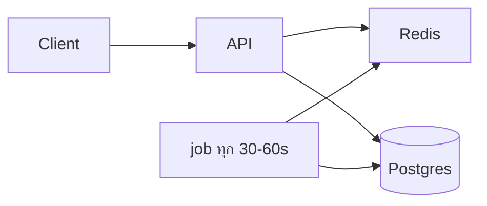
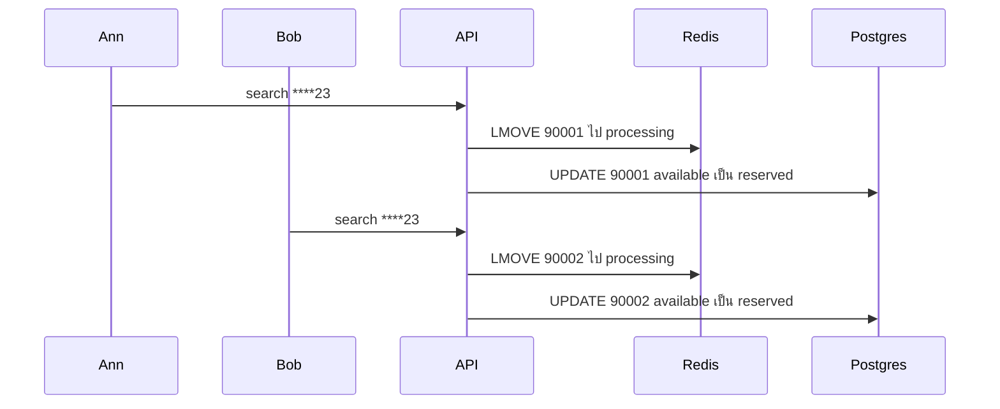

# ระบบค้นหาสลาก

เอกสารออกแบบ ไม่มีโค้ด  
ฉบับอังกฤษ: [`lottery-search.md`](./lottery-search.md)

## โจทย์

สลาก 10 ล้านใบ ใบละ 6 หลัก (`000000`–`999999`)

ค้นด้วย pattern ยาว 6 ตัว ใส่เลขหรือ `*` ก็ได้

| Pattern | ความหมาย |
|---|---|
| `****23` | ลงท้าย 23 |
| `1****5` | ขึ้นต้น 1 ลงท้าย 5 |
| `123***` | ขึ้นต้น 123 |

ห้ามให้คนละคนได้ใบเดียวกันพร้อมกัน และค้นที่สิบล้านแถวยังต้องใช้ได้

โจทย์ไม่ได้บอกว่า API หน้าตาเป็นอย่างไร return กี่ใบต่อครั้ง หรือค้นแล้วถือว่าขายเลยไหม เลยต้องสมมติไว้ก่อน

## สมมติฐาน

ค้นครั้งหนึ่ง return ไม่เกิน 20 ใบ (`limit` 1–50) ไม่ return ทุกใบที่ match เพราะ `****23` อาจเจอเป็นแสน ถ้า return ครบก้อนเดียว ใช้ไม่ได้ และกันใบซ้ำไม่ทัน

ผลค้นคือใบที่จองไว้ 45 วินาที (`reserved`) คนอื่นจะไม่เจอใบชุดนี้ ถ้า confirm ค่อยเป็น `sold` ถ้าปล่อยหรือหมดเวลา กลับเป็น `available` โจทย์ห้ามคนละคนได้ใบเดียวกันพร้อมกัน เลยจองตอนค้น ไม่ขายทันที

ความถูกต้องอยู่ที่ PostgreSQL Redis ช่วย pattern ที่คนค้นบ่อย ถ้า Redis ล่มยังจองที่ Postgres ได้

หนึ่งแถวคือหนึ่งใบ (`id`) `number` คือเลขพิมพ์บนใบ มีสิบล้านใบ แต่เลข 6 หลักมีแค่ล้านค่า เลยเลขซ้ำได้หลายใบ จองไม่ซ้ำที่ `id`

ตัวเลขความเร็วในเอกสารนี้คร่าว ๆ ไม่ได้วัดจากโหลดจริง

Pattern ต้องยาว 6 และแต่ละช่องเป็น `0-9` หรือ `*` นอกนั้น return 400

## ภาพรวมระบบ

```
client → API → Redis (queue / processing)
              → PostgreSQL (tickets, allocations)

background job ทุก 30–60 วินาที (รันตัวเดียว)
  ปล่อย hold ที่หมดเวลา, reclaim processing ที่ค้าง, เติม queue
```

ค้นสิบล้านแถวที่หลักที่ 5 เป็น 2 และหลักที่ 6 เป็น 3 ใน Postgres ทำได้ ถ้า return แค่ 20 ใบและมี index ถูกทาง จุดยากคือคนจำนวนมากค้น pattern เดียวกันพร้อมกัน

เลยให้ Redis `LMOVE` หยิบ id คนละใบใน memory แล้วค่อยให้ Postgres บันทึกว่าจอง ถ้าเก็บแค่ Redis ตามยากว่าใบนี้ตอนนี้เป็นของใคร

ไม่สร้าง queue ครบทุก combination ของ 6 ช่อง จะเยอะเกินไป มีแค่ขึ้นต้น ลงท้าย และแบบที่มี traffic จริง

| Path | กรณี | Redis | Postgres |
|---|---|---|---|
| queue | ขึ้นต้น / ลงท้าย / ทั้งคู่ | ย้าย id ไป processing | อัปเดตตาม `id` |
| SQL | `*2*4*5`, ยังไม่มี queue, Redis ล่ม | lock สั้นถ้าต้องการ | `FOR UPDATE SKIP LOCKED` |



## ทำไมเลือก Postgres + Redis

จองใบแล้วบันทึก `allocations` ใน transaction เดียวกัน ถ้าล่มกลางคัน rollback ได้

`SELECT … FOR UPDATE SKIP LOCKED` ให้หลาย worker หยิบคนละแถว โดยไม่ต้องรอแถวที่คนอื่น lock อยู่ ([เอกสาร](https://www.postgresql.org/docs/current/sql-select.html))

Redis ใช้ `LMOVE` / `BLMOVE` ย้ายงานจาก queue ไป processing ถ้า worker ตาย งานยังอยู่ใน processing เอากลับมาทำต่อได้ ([LMOVE](https://redis.io/docs/latest/commands/lmove/), [job queue](https://redis.io/docs/latest/develop/use-cases/job-queue/go/))  
lock เสริม `SET … NX EX` ลบ lock ได้เฉพาะคนที่ถือ token ([distributed locks](https://redis.io/docs/latest/develop/clients/patterns/distributed-locks/))

ไม่เลือกทางเหล่านี้

- เก็บเป็น string 6 ตัวแล้วค้นด้วย regex — มี `*` แล้วต้องไล่ทั้งก้อน กัน race ก็ยุ่งกว่า `SKIP LOCKED`
- Elasticsearch — ค้นได้ดี แต่จองใบให้คนไม่ได้ ยังต้องมีฐานอยู่ดี และต้อง sync สองฝั่ง
- Redis อย่างเดียว — เร็ว แต่ตามยากว่าใบนี้สถานะอะไร และเก็บประวัติยาวไม่สะดวก
- ใช้ `LIKE` อย่างเดียว — ลงท้ายกับ `*` ตรงกลางใช้ index ธรรมดาได้ไม่ค่อยดี
- `LPOP` แล้วลบทิ้ง — ถ้า process ตายหลังหยิบ แต่ยังไม่อัปเดต Postgres id หายจาก Redis ทั้งที่ใบยังว่าง

## ตาราง tickets / allocations

แยกเป็น `d1`–`d6` เพราะช่องที่รู้ค่าใช้เงื่อนไข `=` ได้ เช่น `d5 = 2` B-tree ใช้กับแบบนี้ได้ดี

```sql
CREATE TABLE tickets (
    id           BIGSERIAL PRIMARY KEY,
    number       CHAR(6) NOT NULL CHECK (number ~ '^[0-9]{6}$'),
    d1           SMALLINT NOT NULL CHECK (d1 BETWEEN 0 AND 9),
    d2           SMALLINT NOT NULL CHECK (d2 BETWEEN 0 AND 9),
    d3           SMALLINT NOT NULL CHECK (d3 BETWEEN 0 AND 9),
    d4           SMALLINT NOT NULL CHECK (d4 BETWEEN 0 AND 9),
    d5           SMALLINT NOT NULL CHECK (d5 BETWEEN 0 AND 9),
    d6           SMALLINT NOT NULL CHECK (d6 BETWEEN 0 AND 9),
    status       TEXT NOT NULL DEFAULT 'available'
                 CHECK (status IN ('available', 'reserved', 'sold')),
    reserved_by  TEXT,
    reserved_at  TIMESTAMPTZ,
    lease_until  TIMESTAMPTZ,
    sold_to      TEXT,
    sold_at      TIMESTAMPTZ,
    version      INT NOT NULL DEFAULT 0,
    CONSTRAINT tickets_digits_match_number CHECK (
        number = d1::text || d2::text || d3::text || d4::text || d5::text || d6::text
    )
);

CREATE TABLE allocations (
    id           BIGSERIAL PRIMARY KEY,
    ticket_id    BIGINT NOT NULL REFERENCES tickets (id),
    user_id      TEXT NOT NULL,
    request_id   TEXT NOT NULL,
    path         TEXT NOT NULL CHECK (path IN ('queue', 'sql', 'sql_fallback')),
    pattern      CHAR(6) NOT NULL,
    state        TEXT NOT NULL CHECK (state IN ('leased', 'confirmed', 'expired', 'released')),
    leased_at    TIMESTAMPTZ NOT NULL DEFAULT NOW(),
    expires_at   TIMESTAMPTZ NOT NULL,
    UNIQUE (request_id, ticket_id)
);

CREATE INDEX allocations_ticket_leased
    ON allocations (ticket_id)
    WHERE state = 'leased';
```

```
available → reserved → sold
                ↓
           available   (หมดเวลาจอง หรือ release)
```

`version` บวกทุกครั้งที่เปลี่ยนสถานะสำเร็จ กันคำสั่งเก่ามาทับสถานะที่ใหม่กว่า

## Index

index หลายคอลัมน์ใช้ prefix จากซ้าย ถ้าสร้าง `(d1,…,d6)` แล้วยังไม่รู้ `d1` แล้วไปกรอง `d2, d4, d6` index ช่วยได้ไม่เต็มที่ เลยทำเฉพาะแบบที่คนค้นบ่อย

```sql
CREATE INDEX idx_t_suffix_2
    ON tickets (d5, d6, id)
    WHERE status = 'available';

CREATE INDEX idx_t_prefix_3
    ON tickets (d1, d2, d3, id)
    WHERE status = 'available';

CREATE INDEX idx_t_prefix_suffix
    ON tickets (d1, d6, id)
    WHERE status = 'available';

CREATE INDEX idx_t_prefix_1
    ON tickets (d1, id)
    WHERE status = 'available';
```

ใส่ `WHERE status = 'available'` จะเหลือแต่ใบว่าง index เล็กลงเมื่อขายไปเยอะ

`*2*4*5` ถ้ามี index ที่เริ่มจากหลักที่รู้ค่าก็ใช้ ไม่งั้นกรองแล้วจำกัดด้วย `LIMIT` กับ `SKIP LOCKED` return ไม่เกิน 50 ใบ ไม่ดึงล้านแถวขึ้น API

index หลายตัวทำให้เขียนช้าลงเล็กน้อย ที่สิบล้านแถวยอมได้ จะไม่ทำ index ทุกแบบของ `*`

## จัดกลุ่ม pattern

pattern ผิด return 400

| ตัวอย่าง | กลุ่ม | SQL | Redis |
|---|---|---|---|
| `****23` | ลงท้าย 2 หลัก | `d5=2 AND d6=3` | `queue:suffix:23` |
| `123***` | ขึ้นต้น 3 หลัก | `d1=1 AND d2=2 AND d3=3` | `queue:prefix:123` |
| `1****5` | ขึ้นต้นและลงท้าย | `d1=1 AND d6=5` | `queue:px:1_5` |
| `*2*4*5` | มี `*` คั่น | `d2=2 AND d4=4 AND d6=5` | ไม่มี |
| `******` | all wildcard | `status='available'` | ไม่มี ใช้ SQL + `LIMIT` |

เลขพิมพ์ซ้ำได้หลายใบ จองไม่ซ้ำที่ `id`

```
id 90001  number 482123
          d1 d2 d3 d4 d5 d6
          4  8  2  1  2  3

****23  → ตรง (ลงท้าย 23)
123***  → ไม่ตรง
1****5  → ไม่ตรง
*2*4*5  → ไม่ตรง
```

## ป้องกัน race condition ตอนจอง

จองสำเร็จเมื่อ Postgres เซฟ `reserved` หรือ `sold` แล้ว Redis แค่ช่วยหยิบ id ให้เร็วขึ้น

ทาง queue ห้าม `LPOP` แล้วลบทิ้ง เพราะถ้า API ล่มก่อนอัปเดต Postgres id หายจาก Redis แต่ใบยังว่าง ให้ย้ายไป processing แทน

```
LMOVE queue:suffix:23  processing:suffix:23  LEFT  LEFT
```

Postgres เสร็จแล้วค่อยลบออกจาก processing และ `SREM` จาก set ถ้า process ตาย job จะเจอของใน processing ที่ค้างเกินประมาณ 60 วินาที ใบว่างก็ `RPUSH` กลับ list ถ้าจองหรือขายแล้วก็ลบจาก processing กับ set

queue เป็น list เพื่อ `LMOVE` ได้ มี set แยก (`set:suffix:23`) ไว้จำ id ที่อยู่ใน queue หรือ processing แล้ว ตอนเติมใช้ `SADD` ก่อน ถ้าเป็นของใหม่ค่อย `RPUSH` เข้า list ห้าม `LMOVE` จาก set ถ้า `RPUSH` จาก snapshot SQL ตรง ๆ id อาจซ้ำในคิว Postgres ยังไม่ให้จองใบซ้ำ แต่เสียรอบ retry

ทาง SQL:

```sql
WITH picked AS (
    SELECT id
    FROM tickets
    WHERE d2 = 2 AND d4 = 4 AND d6 = 5
      AND status = 'available'
    ORDER BY id
    LIMIT 20
    FOR UPDATE SKIP LOCKED
)
UPDATE tickets t
SET status = 'reserved',
    reserved_by = :request_id,
    reserved_at = NOW(),
    lease_until = NOW() + INTERVAL '45 seconds',
    version = t.version + 1
FROM picked
WHERE t.id = picked.id
  AND t.status = 'available'
RETURNING t.id, t.number;
```

คนหลังข้ามแถวที่ถูก lock ไปหยิบใบถัดไป

lock Redis `SET lock:ticket:<id> <request_id> NX EX 30` เป็นของเสริม ใช้ Lua ลบได้เฉพาะเมื่อค่ายังเป็นของเรา ไม่ควร `DEL` ตรง ๆ เพราะอาจลบ lock ของคนอื่น

ไม่ว่าจะมาทาง queue หรือ SQL อัปเดตได้เฉพาะตอนใบยังว่าง:

```sql
UPDATE tickets
SET status = 'reserved',
    reserved_by = :request_id,
    reserved_at = NOW(),
    lease_until = NOW() + INTERVAL '45 seconds',
    version = version + 1
WHERE id = :id
  AND status = 'available';
```

ถ้าไม่มีใบถูกอัปเดต แปลว่ามีคนอื่นจองไปแล้ว ให้ลองใบถัดไป แล้ว insert `allocations` ใน transaction เดียวกัน

ถ้า pattern ใช้ได้แต่ไม่มีใบว่าง ให้ return 200 พร้อม list ว่าง ไม่ใช่ 404

ตอน confirm ใบต้องยังเป็น `reserved` ของ request นี้และยังไม่หมดเวลา ถึงจะเปลี่ยนเป็น `sold`  
ถ้า release หรือหมดเวลา กลับเป็น `available`

## Redis key

| Key | Purpose |
|---|---|
| `queue:suffix:23` | ids รอใน list |
| `processing:suffix:23` | หยิบแล้ว ยังไม่จองที่ Postgres (list) |
| `set:suffix:23` | id ที่อยู่ใน queue หรือ processing แล้ว |
| `lock:ticket:<id>` | short lock (TTL) |
| `meta:reconcile:last_run` | เวลาที่ job รันล่าสุด |

สร้างเท่าที่ต้องใช้: ลงท้าย 2 หลักมี 100 อัน (`00`–`99`) ขึ้นต้น 3 หลักสร้างตอนมีคนค้นครั้งแรก ไม่สร้างครบตอนเปิดเครื่อง ขึ้นต้น+ลงท้ายสร้างเฉพาะที่มี traffic จริง

ไม่ควรใส่ใบเดียวกันลงทุก queue ที่มันเข้าได้ เพราะใช้ RAM มากเกิน เริ่มจากลงท้าย 2 หลัก แบบที่มี `*` คั่นใช้ SQL อย่างเดียว

## Background job (ทุก 30–60 วินาที)

รันตัวเดียว (lock ที่ Postgres หรือ Redis `SET NX`)

1. `reserved` ที่ `lease_until` ผ่านแล้ว → `available`
2. processing ค้างเกินประมาณ 60 วินาที: ว่างก็ `RPUSH` กลับ list จองหรือขายแล้วก็ลบจาก processing กับ set
3. ถ้า list ของ queue สั้นกว่าที่กำหนด (เช่น 500) ค่อยดึง `id` ว่างจาก Postgres `SADD` แล้ว `RPUSH` ถ้าเป็นของใหม่
4. บันทึกเวลาที่ job รันล่าสุด ถ้า job ค้าง API สลับไป SQL ได้

## Log

ทุกคำขอมี `request_id` log เป็น JSON บอก path, pattern, id ที่จอง, latency

ดูจำนวนใน queue, processing ที่ค้าง, hold ที่เลย `lease_until`, เวลาที่ job รันล่าสุด, สัดส่วน queue กับ SQL

ค้นด้วย `request_id` ครั้งเดียวควรไล่ทั้ง flow ได้

## ความเร็วโดยประมาณ

ทาง queue ใช้เวลาไม่กี่ ms ทาง SQL ประมาณ 5–20 ms ที่ `LIMIT 20`

ลงท้าย 2 หลักก่อน `LIMIT` ราว 1% ของตาราง (ประมาณแสนแถว) แต่ `LIMIT 20` หยุดเร็ว ขึ้นต้น 3 หลักราว 0.1%

Redis ล่มแล้วทุกคำขอไป Postgres ความถูกต้องยังอยู่ แต่ throughput ลดตามเครื่องฐาน bottleneck อยู่ที่ Postgres จองได้หลักพันครั้งต่อวินาทีบนเครื่องธรรมดา ไม่ใช่หลักแสน

Redis ทำให้ pattern ที่คนค้นบ่อยเร็วขึ้น ฐานไม่ต้องรับค้นหนัก ความถูกต้องอยู่ที่ `UPDATE … WHERE status = 'available'` ไม่ได้อยู่ที่ Redis

แยกหลักเป็นคอลัมน์แล้วเพิ่ม index กินดิสก์และเขียนช้าลงเล็กน้อย แลกกับที่ pattern ในโจทย์ใช้ index ได้ตรงกว่า

## กรณี failure

| กรณี | ผล |
|---|---|
| คนสองคนค้น pattern เดียวกัน | คนละ `id` จาก queue หรือ `SKIP LOCKED` |
| process ตายหลัง `LMOVE` ก่อน SQL | ค้างที่ processing ว่างก็ย้ายกลับ queue |
| process ตายหลัง SQL ก่อนลบ processing | job ลบออกจาก processing เพราะใบจองหรือขายแล้ว |
| Redis ล่ม | ค้นและจองที่ Postgres อย่างเดียว |
| lock Redis หมดอายุกลางคำขอ | ลบได้แค่ lock ของ request นี้ คนอื่นจองใบนี้ที่ Postgres ไม่ได้ |
| id ซ้ำในคิว | ไม่มีใบถูกอัปเดต ไปใบถัดไป |
| จองหมดเวลา แต่ client ยังมี response อยู่ | confirm ไม่ผ่าน ต้องค้นใหม่ |

ดู [ตัวอย่าง](#ตัวอย่าง)

## ตัวอย่าง

ไล่ตามตารางด้านบนทีละแถว ใช้ใบสามใบนี้ทั้งหัวข้อ

| id | number | สถานะตอนเริ่ม |
|---|---|---|
| 90001 | 482123 | available |
| 90002 | 000023 | available |
| 90003 | 999923 | available |

### คนสองคนค้น pattern เดียวกัน

Ann กับ Bob ส่ง `POST /lottery/search` pattern `****23` `limit` 1 ในเวลาเดียวกัน

```
queue:suffix:23  [90001, 90002, 90003]
```



Ann ได้ `90001` (`482123`) Bob ได้ `90002` (`000023`) ไม่มีใครได้ `90001` ซ้ำ เพราะ `LMOVE` ดึง id ออกจาก list แล้ว และ Postgres อัปเดตได้เฉพาะตอน `status = 'available'`

### process ตายหลัง LMOVE ก่อน SQL

API ของ Ann `LMOVE` `90001` ไป processing แล้ว process ตายก่อนรัน Postgres

```
queue:suffix:23       [90002, 90003]
processing:suffix:23  [90001]
tickets 90001         ยัง available
```

job เจอ `90001` ใน processing นานเกินประมาณ 60 วินาที แถวยัง `available` ก็ `RPUSH` กลับ list Bob ค้นต่อแล้วหยิบได้ ถ้าใช้ `LPOP` `90001` จะหายจาก Redis ทั้งที่ใบยังว่าง

### process ตายหลัง SQL ก่อนลบ processing

Postgres เซฟ `90001` เป็น `reserved` ของ Ann แล้ว process ตาย `90001` ยังค้างใน processing

job เห็นว่าจองหรือขายแล้ว ก็ลบออกจาก processing กับ set ใบยังเป็นของ Ann จน confirm หรือหมดเวลา 45 วินาที

### Redis ล่ม

Ann ค้น `****23` ไม่มี queue API ใช้ `FOR UPDATE SKIP LOCKED` ที่ `d5 = 2 AND d6 = 3` `LIMIT 1` ยังได้ `90001` ช้าลง แต่ยังไม่ซ้ำกับคนอื่น

### id ซ้ำในคิว

`90001` อยู่ใน list สองครั้งเพราะเติมคิวพลาด Ann หยิบอันแรก Postgres เป็น `reserved` Bob หยิบอันที่สอง `UPDATE … AND status = 'available'` ไม่มีใบถูกอัปเดต API ไปใบถัดไป (`90002`)

### จองหมดเวลา แต่ยังถือ response

Ann ค้นตอน 12:00:00 ยังถือ `requestId` กับ `90001` อยู่ ตอน 12:00:50 job คืน `90001` เป็น `available` แล้ว confirm ไม่ผ่าน ต้องค้นใหม่

### ทาง SQL มี `*` คั่น

Ann ค้น `*2*4*5` ไม่มี queue Redis Postgres หยิบใบว่างที่ `d2 = 2 AND d4 = 4 AND d6 = 5` เลขที่ตรงเช่น `121415` Bob ค้นในเวลาเดียวกัน ข้ามแถวที่ Ann lock อยู่ แล้วไปใบว่างถัดไป

## ตัวอย่าง API

ยังไม่มีโค้ดในรอบนี้

```
POST /lottery/search
{ "pattern": "****23", "limit": 20 }
```

ได้ `requestId` และใบที่จองไว้ 45 วินาที มี `exhausted` ถ้าของหมด

```
POST /lottery/confirm
{ "requestId": "…", "ticketIds": [90001] }
```

pattern ผิด return 400 ถ้าไม่มีใบว่าง return 200 กับ list ว่าง

## สรุปสั้น ๆ

เก็บที่ Postgres หนึ่งแถวต่อหนึ่งใบ แยกหลักเป็นคอลัมน์ index ตามที่คนค้นบ่อย จอง 45 วินาที กัน race ด้วย `SKIP LOCKED` และอัปเดตได้เฉพาะตอนใบยังว่าง

Redis ช่วย pattern ที่คนค้นบ่อย ย้ายไป processing ไม่ใช่ LPOP แล้วลบทิ้ง มี job reclaim ของที่ค้าง ถ้า Redis ล่มยังจองที่ Postgres ได้ แค่ช้าลง

สิบล้านแถวอยู่ในเครื่องเดียวได้ จุดยากคือคนค้นพร้อมกันแล้วห้ามได้ใบซ้ำ
